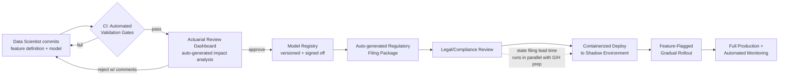

# From Model to Market: Compressing Root's Pricing Deployment Lifecycle

**A product case study by Ade Okerinde** — prepared for the Senior Product Manager, Pricing role at Root Insurance.

> **A note on sourcing:** This case study is built entirely from Root's public job description and industry-standard
> knowledge of P&C insurance pricing operations. It does not reflect Root's actual internal architecture, Rating Plan
> Manager codebase, or proprietary data — all timelines, tech choices, and metrics below are illustrative estimates
> meant to demonstrate my problem-solving approach, not claims about Root's real systems. I built it to show how I'd
> think about their #1 stated velocity problem on day one.

---

## 1. Problem Framing & Business Context

Root's job posting names this directly: *"accelerate the path from new data and model features to production
deployment."* That's not a vague aspiration — it's a symptom of a very specific, very common insurance-tech pattern:
**pricing is the one product surface where "ship it" isn't a deploy button, it's a multi-department negotiation.**

### The bottleneck, broken down

| Bottleneck | What actually happens | Typical added latency |
|---|---|---|
| **Actuarial review cycles** | A new rating variable or model refresh needs actuarial sign-off on indicated vs. selected rates, impact analysis, and rate disruption checks before it can move forward | 2–6 weeks |
| **IT/engineering deployment queues** | Pricing logic changes often live in the same release train as unrelated platform work, so a rate change waits for the next scheduled deploy window | 1–4 weeks |
| **Regulatory filing delays** | Rate changes in most U.S. states require a filing (SERFF) with the Department of Insurance; some states are "file and use," others "prior approval" with 30–90+ day review windows | 30–90+ days (varies by state) |
| **Model validation backlogs** | New ML-driven rating factors need bias/fairness testing, back-testing against historical loss data, and often a shadow-mode period before cutover | 2–8 weeks |
| **Serialized handoffs** | Data science → actuarial → engineering → legal → filing typically happens in sequence, not in parallel, because each team works off the previous team's output as a static artifact (spreadsheet, PDF, email) | Compounds all of the above |

Stacked serially, a single rating factor change at a legacy or growth-stage insurer commonly takes **10–16 weeks**
from "we have a better model" to "it's live and collecting premium." None of these constraints can be *removed* —
actuarial review and regulatory filing are non-negotiable in this industry. But most of the elapsed time isn't spent
doing the regulated work; it's spent **waiting for a handoff, re-deriving context the previous team already had, or
re-running validation because the underlying data pipeline changed underneath the model.**

### Why this matters financially

- **Speed-to-market advantage compounds.** In usage-based/telematics-first insurance, the whole competitive thesis is
that better data → better risk selection → better loss ratio *faster than competitors can react*. A 3-month lag on
deploying a pricing insight is 3 months of adverse selection risk and lost margin capture, concentrated exactly in the
segments where the new model would have been most differentiating.
- **Lost premium opportunity is compounding, not one-time.** Every week a validated, filed rate improvement sits
undeployed is a week of premium collected at the *old*, less accurate price — in the wrong direction for the segments
the new model would have repriced favorably.
- **Operational cost of serialized handoffs.** Each re-validation cycle triggered by an upstream change (a data
schema shift, a late actuarial comment, a re-filed exhibit) consumes actuarial, DS, and engineering hours that don't
show up as "features shipped" — it's pure coordination tax.

This case study proposes an architecture that doesn't shortcut actuarial rigor or regulatory compliance — it
**parallelizes and instruments** the handoffs between the teams that already have to work together, so the elapsed
calendar time collapses even though the required review steps don't.

---

## 2. Current State Analysis — The 14-Week Baseline

See [`docs/before-after-timeline.md`](docs/before-after-timeline.md) for the full stage-by-stage table. Summary:

```
Week 0-2   Data science finalizes feature/model (offline, notebook-based)
Week 2-3   Manual handoff to actuarial as spreadsheet/PDF exhibit
Week 3-7   Actuarial review, rate impact analysis, back-and-forth clarifications
Week 7-8   Engineering re-implements the model/feature from actuarial's final spec (re-derivation, not reuse)
Week 8-9   QA/UAT in a staging environment that doesn't match production data freshness
Week 9-9.5 Legal/compliance review of consumer-facing rate factor disclosures
Week 9.5-13 Regulatory filing prepared, submitted, and under DOI review
Week 13-14 Deployment queued into next release train; manual rollout to 100% of traffic
─────────────────────────────────────────────────────────
Total: ~14 weeks, mostly waiting on handoffs, not doing regulated work
```

**Root friction points this surfaces** (directly from the JD's language):
- Manual, spreadsheet-based data pipelines between DS and actuarial
- Serialized (not parallel) handoffs across DS → actuarial → engineering → legal
- Environment inconsistencies between where a model is validated and where it runs in production
- No automated regression testing specific to pricing logic (a schema change silently breaks a rating factor)
- No shared source of truth — actuarial's "final" spec and engineering's "implemented" version can drift

---

## 3. Proposed Solution Architecture

**Core idea:** treat a rating factor/model feature the way modern software treats any other artifact — **version
controlled, automatically validated, progressively rolled out, and self-documenting for compliance** — without
removing a single required human review step.



Full diagram with swimlanes by team: [`diagrams/pipeline-swimlane.mmd`](diagrams/pipeline-swimlane.mmd)

### The five components that compress the timeline

1. **Version-controlled feature definitions** — every rating variable and model version lives as a YAML/code artifact
in git, not a spreadsheet. Actuarial comments and approvals happen as reviewed pull requests, so there's one source
of truth instead of three (DS's notebook, actuarial's exhibit, engineering's re-implementation).
   → Sample: [`pipeline/feature_definitions/rating_variable.yaml`](pipeline/feature_definitions/rating_variable.yaml)

2. **Automated data quality + model validation gates** — CI checks run automatically on every proposed change:
schema conformance, back-test against holdout loss data, fairness/disparate-impact checks, rate disruption thresholds.
This turns "wait for someone to manually re-run validation" into "validation runs in minutes, every time."
   → Sample: [`pipeline/data_quality/validation_gates.py`](pipeline/data_quality/validation_gates.py)

3. **Containerized deployment environments** — the model runs in the *same* container from validation through
shadow mode to production, eliminating "it worked in the notebook but broke in prod" environment drift.
   → Sample: [`pipeline/deployment/Dockerfile`](pipeline/deployment/Dockerfile)

4. **Feature flags for gradual rollout** — a filed, approved rate change deploys behind a flag at 1% → 10% → 100% of
applicable traffic, with automated rollback if loss-ratio or conversion guardrails trip. This decouples "code is
deployed" from "customers are affected," which is what makes it safe to deploy *before* 100% rollout is desired.
   → Sample: [`pipeline/deployment/feature_flags.py`](pipeline/deployment/feature_flags.py)

5. **Automated regulatory documentation generation** — the filing exhibit (rate impact tables, actuarial
justification narrative, disclosure language) is templated and auto-populated from the same versioned feature
definition and validation results actuarial already approved — turning a multi-day manual drafting exercise into a
same-day review-and-submit exercise.
   → Sample: [`pipeline/regulatory_docs/generate_filing_doc.py`](pipeline/regulatory_docs/generate_filing_doc.py)

### Technical stack

| Layer | Tool (illustrative) | Why |
|---|---|---|
| Feature/model definition | Python, YAML, [dbt](https://www.getdbt.com/) for transformation lineage | Version-controllable, human-readable, diffable in PRs |
| Model registry & versioning | [MLflow](https://mlflow.org/) | Standard, auditable model lifecycle tracking with stage transitions (staging → prod) |
| Validation & CI/CD | [GitHub Actions](https://github.com/features/actions), `pytest` | Runs data quality + fairness gates on every PR; blocks merge on failure |
| Deployment | Docker, Kubernetes (or managed equivalent) | Environment parity from validation through production |
| Feature flagging | [LaunchDarkly](https://launchdarkly.com/)-style flag service (open-source equivalent: [Unleash](https://www.getunleash.io/)) | Decouples deploy from release; enables guarded rollout |
| Regulatory doc generation | Python + Jinja2 templating | Auto-populates SERFF-style exhibits from approved, versioned inputs |
| Cloud infra | AWS (matches Root's public engineering blog stack) | Managed scalability, matches likely existing environment |

---

## 4. Measurable Outcomes & Success Metrics

| Metric | Baseline (illustrative) | Target | How |
|---|---|---|---|
| Feature-to-production cycle time | ~14 weeks | ~4–6 weeks | Parallelized handoffs + automated validation/doc-gen (regulatory filing lead time becomes the critical path, not an add-on) |
| Deployment frequency (pricing changes/quarter) | 1–2 | 6–8 | Smaller, flagged, more frequent changes replace large infrequent releases |
| Rollback rate | Unmeasured / ad hoc | <5%, tracked | Automated guardrail monitoring on shadow + gradual rollout |
| Time-to-rate-new-segment (e.g., new state or usage-based tier) | 4–6 months | 6–8 weeks post-data-availability | Reusable, parameterized pipeline instead of bespoke build per state |
| Manual coordination hours per rate change | Untracked, high | Tracked, -50% | Version-controlled artifacts replace re-derivation across teams |
| Model refresh frequency | Annual/semi-annual | Quarterly | Lower marginal cost per iteration once pipeline is reusable |

These are the numbers I'd actually propose instrumenting in the first 90 days — not commitments, but the KPI
framework I'd bring to the roadmap conversation.

---

## 5. Root-Specific Customization

A few things I deliberately built this around, based on Root's public positioning:

- **Telematics-first data**: Root's core differentiator is behavioral driving data feeding pricing models, which
means the "data science → production pricing" path is core product, not a side workflow — this is exactly why the
JD calls it a strategic advantage rather than a back-office function.
- **Mobile-centric acquisition**: fast iteration on pricing needs to keep pace with fast iteration on the app/quote
flow — a 14-week pricing cycle next to weekly app releases is a visible internal mismatch worth naming.
- **State-by-state expansion**: the architecture's "parameterized pipeline instead of bespoke build per state" point
directly addresses the JD's call to "adapt pricing capabilities to meet the specific regulatory and operational needs
of new states" — the filing-doc generator and validation gates should be state-config-driven, not state-specific
codebases.
- **Rating Plan Manager**: I don't have visibility into RPM's actual architecture, so I've deliberately framed
Section 3 as *pipeline components RPM likely needs to interoperate with* rather than a rewrite proposal — this is a
case study demonstrating my approach, and the first real task in the role would be learning what RPM already does
well before proposing changes to it.

### Comparable industry parallels
- **Lemonade** has publicly discussed automating claims and underwriting decisioning end-to-end with continuous
model deployment — the same "compress serialized handoffs" logic applied to claims rather than pricing.
- **Progressive's** Snapshot usage-based program is a public example of an insurer iterating pricing models against
telematics data at a cadence that legacy carriers historically couldn't match — evidence for the "speed is the
competitive moat" framing in Section 1.

---

## Repository Map

```
root-pricing-velocity-case-study/
├── README.md                              ← you are here
├── diagrams/
│   └── pipeline-swimlane.mmd              ← team-by-team swimlane (Mermaid)
├── docs/
│   ├── before-after-timeline.md           ← stage-by-stage baseline vs. proposed
│   ├── presentation-strategy.md           ← how to present this per interview round
│   ├── demo-day-script.md                 ← 10-15 min walkthrough outline
│   └── lessons-learned.md                 ← postmortem / what I'd validate first
└── pipeline/
    ├── feature_definitions/
    │   └── rating_variable.yaml           ← versioned feature definition example
    ├── data_quality/
    │   └── validation_gates.py            ← automated validation gate sample
    ├── model_registry/
    │   └── register_model.py              ← MLflow-style registration sample
    ├── ci_cd/.github/workflows/
    │   └── pricing-pipeline.yml           ← GitHub Actions CI/CD sample
    ├── deployment/
    │   ├── Dockerfile
    │   └── feature_flags.py               ← gradual rollout sample
    └── regulatory_docs/
        └── generate_filing_doc.py         ← auto-generated filing exhibit sample
```
